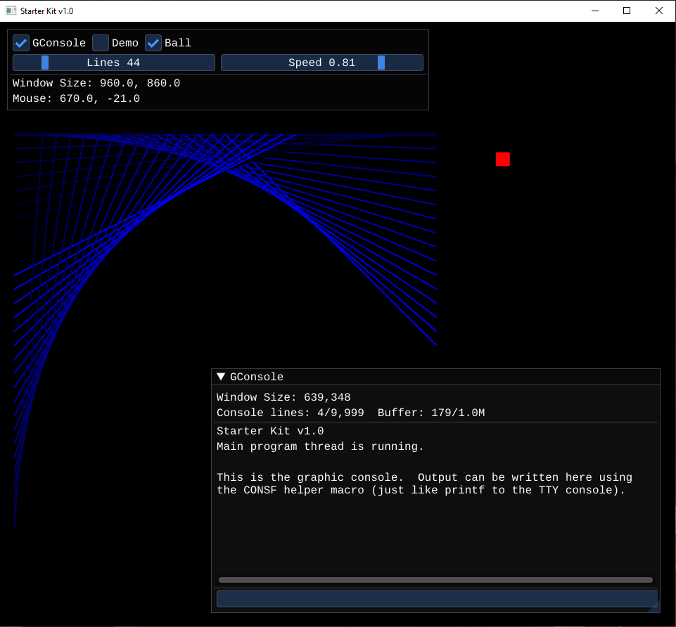

# Starter Kit for Cross-Platform Program Development.

The Starter Kit is a small set of C/C++ files to quickly get started writing a cross-platform graphic-capable program.  An executable program created with this kit will be small and only have a few dynamic-link library (DLL for Windows) or Shared-Object (SO for Unix-like) dependencies that are not already part of the host operating system.

The default configuration uses SDL2 and OpenGL3.x for the graphics abstraction layer, and IMGUI for widgets and controls.  C is the primary language, however since IMGUI is written using some C++ features, a C++ compiler is also required.

The Starter Kit is deliberately small and does only a minimum amount of setup necessary to get a graphic-capable program running that can use a "modern" GPU (meaning, closed proprietary hardware and drivers) that requires an OS like Windows, Unix, or MAC.  A standard event-loop, rendering thread, and a main program thread are provided which makes starting a new project very similar to a basic "Hello, World" C program.  A minimal graphic console is also included, so getting text output is ready to go.  The rest is up to you.

Writing programs for a personal-computer (PC) has become overly complicated, much more so than it needs to be.  While there are many "frameworks" available, using one (or more) is just "yet another layer" to be learned, become frustrated with, and locked into.  The Starter Kit attempts to provide the minimal amount of layering and dependencies necessary to start writing platform independent programs.

For the impatient, where to look for stuff:

- To start adding program specific code, see the `main_program()` function in `program.c`.
- For drawing see the `draw()` call-back function in `program.c` and the `cpp_stuff.cpp` file.
- To make IMGUI windows with widgets an controls see the `cpp_stuff.cpp` file.
- For event handling, use the `events()` call-back function in `program.c`.
- The actual `main()` function is in `disco.cpp`.

The Starter Kit is just that, a starting point, you are expected to change it and make it your own.




## Last Build Versions - Dec 13, 2022

- gcc 12.2.0 x86
- clang 15.0.5 x86
- VS2019 19.29.30147 x86
- SDL2 2.26.1
- imgui 1.89.1
- stb_sprintf 1.10


## Requirements

- A C and C++ compiler
- An SDL2 supported OS
- CMake (or your own build system)


## Dependencies and Build

TL;DR: Clone or download the dependency libraries into the `src/deps` directory, which should end up something like this:

```
src/deps/imgui
src/deps/SDL2_mingw_2.26.1 (or "SDL2_vc_2.26.1" for VS SDL2 lib)
src/deps/stb
```

Edit the top CMakeLists.txt file to specify the exact directory for the libraries (SDL2 mostly).

Run the build script (build_win.bat or build_unix.sh) for your OS.


### Dependencies and Build, Longer Version

The following libraries are used to provide abstraction and cross platform support.  The libraries are all open-source or public domain, and written in C or C++.

All libraries support Unix/Win/MAC.

- SDL2, download the prebuilt development version and extract to src/deps/SDL2, or install SDL2 with your system package manager.(1)
- IMGUI, clone into src/deps/imgui.
- STB, clone into src/deps/stb.

Note(1): If SDL2 is installed with a package manager, be sure to include the SDL2 "development library" as well.


### SDL2 2.x

Provides cross platform windowing, graphics, sound, events, user I/O, threads, and file I/O.

- Website:  [https://libsdl.org/](https://libsdl.org/)
- Clone:    [http://hg.libsdl.org/SDL](http://hg.libsdl.org/SDL)
- Download: [https://libsdl.org/download-2.0.php](https://libsdl.org/download-2.0.php)
- Docs:     [https://wiki.libsdl.org/FrontPage](https://wiki.libsdl.org/FrontPage)

Use prebuilt DLLs for Windows, install dev libs via package manager on Unix systems.


### IMGUI

Cross platform Immediate-Mode widgets and controls.  Allows for very responsive programs that are easy to write.

- Website:  [https://github.com/ocornut/imgui](https://github.com/ocornut/imgui)
- Clone:    [https://github.com/ocornut/imgui.git](https://github.com/ocornut/imgui.git)
- Docs:     [https://github.com/ocornut/imgui/tree/master/docs](https://github.com/ocornut/imgui/tree/master/docs)

Included as source and built as part of the program.  The project has example code and support for almost every OS and graphics abstraction layer, so feel free to use whatever you want.


### STB

Single-file public domain (or MIT licensed) libraries for C/C++.  Currently `stb_sprintf` is the main requirement from this collection.

- Website:  [https://github.com/nothings/stb](https://github.com/nothings/stb)
- Clone:    [https://github.com/nothings/stb.git](https://github.com/nothings/stb.git)
- Docs:     See each source file.

Included as source and built as part of the program.

----

## Compiling

Once the dependencies are set up, edit the CMakeLists.txt file to specify the exact directory for the libraries (SDL2 mostly).  The SDL2 developer library path must be specified so it can be found by the compiler.  Most of the "FindSDL2" CMake modules out there are just overly complicated, IMO, and failed to work correctly.  It is much easier to just tell the compiler where the lib is located.

Building the Starter Kit can be done with one of the provided scripts:

- `build_win.bat` for Windows.
- `build_unix.sh` for Unix or MAC (MAC compiling / testing is a big TODO).

The scripts are very basic and simply use the system agnostic CMake commands that do the following (build_unix or build_win, depending on which is run):

```
$ mkdir build_unix
$ cd build_unix
$ cmake ..
$ cmake --build .
```

The final executable can be found in:

- `build_unix/bin/starterkit` on Unix / Mac
- `build_win/bin/Debug/starterkit.exe` on Windows.

Visual Studio creates the `Debug` and `Release` directories inside the specified build directory.

Windows also needs the `SDL2.dll` in the same directory as the executable, and the CMake script attempts to copy the correct (32-bit or 64-bit) `SDL2.dll` to the executable path.  If CMakes fails to copy the file, you will need to do so manually (see the SDL2 dependency `libs` directory).

Program distribution should only require the executable itself and `SDL2.dll` for Windows; it is assumed that a Unix system will have the `SDL2.so` shared object installed with the system, i.e. via the package manager.

The default build will statically link core libs, so when compiling with MinGW, for example, the MinGW DLLs are *not* required to be distributed with the executable.


----


## Code Organization

The code is roughly split into to main parts, the OS abstraction (event I/O and rendering) and the program.  The abstraction part is called `disco`, which is an attempt to be a catchy name for "Display and I/O".

The SDL2 event-handler (the message pump) is required to run on the main process, i.e. the process started by the OS when the program is run.  To create a program that is event-friendly and CPU-use friendly, a typical message pump likes to block in a system call waiting on events.

Programs like games and emulators have much to do other than process user input, while typical "desktop" programs tend to be more event-driven.  So, to allow the program to do cool things other that sit an wait on user input, two additional threads are created:

1. A rendering thread.  This allows the program to have a responsive interface and update the window while it is being dragged, resized, etc.
2. A program thread.  This is essentially "the program" where all the other cool stuff happens.

The program can also set up event and rendering call-back functions, which is where program-specific event handling and drawing should take place.  So, from the "program perspective" there is a main-thread, an event function, and a drawing function.  Widget and control events are mostly taken care of by IMGUI, so getting a graphic interface up and running is very quick and easy.

The program organization looks something like this:

```
OS
  WinMain / SDLmain
  main()
    program_init() (one time pre-run initialization)
    disco() ---creates---+--> render_thread() --calls--> draw() callback
                         +--> program_thread()
      event loop
        event() callback

    clean-up() callback
```

The rendering thread is set to synchronize with the display's vertical sync, so the `draw()` call-back will be called once per frame.  The `event()` call-back will be called any time there is a message not handled by IMGUI.  The `program_thread()` is running all the time.

The graphic-context for the window is created in the render thread, so all drawing needs to happen in that thread or in functions called by that thread, like in the `draw()` call-back.


----

## IMGUI Fonts

IMGUI provides some true-type fonts to use instead of the single built-in "proggy-clean" font.

- "Cousine" font has slashed zeros, so it wins.
- "Roboto" font is also nice looking, as well as "Karla".

The true-type fonts need to be converted to a header file and included in the source code.  IMGUI comes with a simple utility to do the conversion.

Building and converting a font using a VS2019 command prompt (unix shell would just use the system compiler):

```
$ cd deps/imgui/misc/fonts

// pick one of these depending on your system compiler:
$ cl binary_to_compressed_c.cpp
$ clang -o binary_to_compressed_c binary_to_compressed_c.cpp
$ g++ -o binary_to_compressed_c binary_to_compressed_c.cpp

// Convert a font file to a compressed header:
$ ./binary_to_compressed_c.exe -base85 Cousine-Regular.ttf cousine_font > cousine_font.h

// Copy the font header to the primary source directory and include like this:
#include "cousine_font.h"

// Add to IMGUI with:
ImGui::GetIO().Fonts->AddFontFromMemoryCompressedBase85TTF(cousine_font_compressed_data_base85, 18);
```

----

## License

In the spirit of the STB library, this code is in the public domain. You can do anything you want with it.  You have no legal obligation to do anything else, although I really appreciate attribution.

The code is also licensed under the MIT open source license, if you are unhappy about using public domain.  Every source file includes an explicit dual-license for you to choose from.
